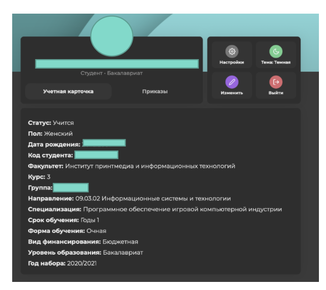
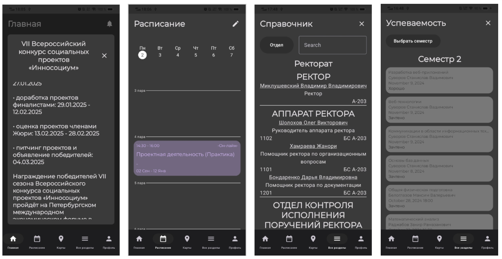

# Промежуточные результаты работы:

## Личный кабинет:
В прошлом семестре была создана таблица багов на базе Google Таблиц. Всего было найдено 57 багов на различных операционных системах и в разных браузерах. Теперь необходимо направить силы на исправление багов со стороны разработчиков. Технический руководитель выдвинул требования для фронтэнд-разработчиков, которые нужны в текущую техническую команду нового личного кабинета: уверенное знание React, базовые знания TypeScript, опыт работы с Effector, базовые знания styled-components, владение Responsive design, владение Feature sliced design, базовое знание Git, базовые знания работы с API, глубокие знания CSS, широкие знания HTML, знания Web accessibility. Из ребят сейчас направил свое резюме Никитин Руслан Романович, ждём ответа от технического руководителя.

## Сервис визуализации данных колл-центра:
В середине февраля в Московском Политехе произошёл глобальный сбой серверов, который коснулся всего документооборота и сервиса визуализации данных в частности. Произошёл сбой в доступе к базе данных колл-центра. Были установлены пароли по умолчанию, из-за чего доступ к базе данных оказался для нас закрыт.После переговоров с технической группой и подрядчиками доступ к базе данных был восстановлен. Технической группой был развернут AMI 1 на сервере, где находится Grafana, на порте 5038. Сейчас мы пытаемся подключится к AMI через TCP.

## Мобильное приложение личного кабинета на базе Android
- улучшили меры безопасности/сохранности пользовательских данных внутри приложения. Была найдена недоработка в процессе аутентификации пользователя на стороне сервера, в следствие чего был имплементирован новый способ хранения личной информации в приложении, дабы избежать утечки данных;
- был имплементирован свайп-пейджер на вкладках внутри приложения, который функционирует наряду с навигационной панелью, для увеличения комфорта пользования;
- были исправлены различные найденные внутри уже сделанных модулей визуальные баги, обнаруженные командой тестировщиков;
- был разработан сплеш экран для приложения, улучшающий пользовательский опыт;
- имплементированы иконки для приложения, соответствующие современным гайдлайнам дизайна ОС android.

## Мобильное приложение личного кабинета на базе IOS
На данный момент выполнена только часть задач, относящаяся к планированию и начальной стадии разработки. Команда разработчиков сейчас занимается изучением данных в API и верстает черновые экраны для будущих функций, команда дизайна же занята постепенной проработкой каждого из экранов.
Со стороны дизайна ведётся редизайн с прошлого семестра с учётом гайдлайна IOS со светлой и тёмной темами.

## Политайм
В ходе работы была разработана база данных, а MVP серверной части:
- документация API (рис. 5);
- регистрация и авторизация с использованием jwt токенов (access и refresh);
- подтверждение почты, рассылка email’ов;
- получение расписания
- получение списка предметов и типов задач
- получение списка задач для группы и индивидуальных задач;
- добавление групповой задачи старостой и индивидуальной задачи студентом;
- удаление и изменение задач;
- фильтрация и сортировка задач;
- выполнение задачи и отмена выполнения (индивидуально для каждого пользователя);
- добавление и изменение заметок к задачам (индивидуально для каждого пользователя)

## Система парсинга и анализа данных
Ожидаемые результаты включают несколько ключевых аспектов. Автоматизированный парсер способен обрабатывать разнородные источники данных и поддерживает динамическую загрузку страниц. База данных содержит структурированные данные, очищенные от дубликатов, и включает извлечённые сущности, такие как компании, технологии, даты и локации. Генератор контента создаёт статьи и дайджесты на основе обработанных данных, а также поддерживает настройку стиля и формата выходных материалов. Готовая система интегрирована в единый конвейер, охватывающий этапы парсинга, обработки и генерации, и готова к использованию в реальных условиях.

